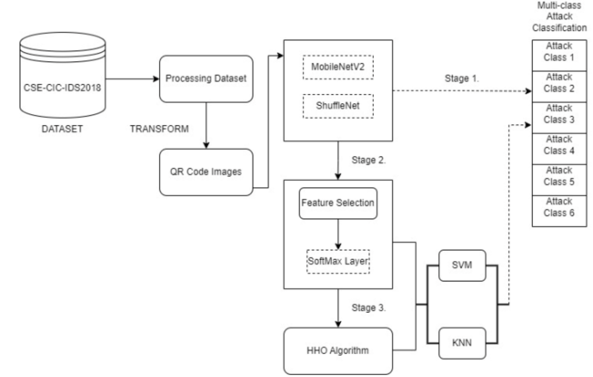

# QRNetV2: Lightweight Intrusion Detection System 🛡️

[](https://www.python.org/downloads/)
[](https://tensorflow.org/)
[](LICENSE)
[](##results)

> **A high-performance, lightweight intrusion detection system using optimized deep learning models for real-time cybersecurity threat classification.**

## 🎯 Overview

With the rapid advancement of technology, cybersecurity threats have become increasingly sophisticated, putting personal and organizational data at risk across various devices and platforms. This project addresses these concerns by developing **QRNetV2**, an efficient multi-class attack classification system that balances high accuracy with computational efficiency.

Our solution leverages lightweight deep learning architectures optimized through advanced meta-heuristic algorithms to deliver state-of-the-art performance in network intrusion detection.

## ✨ Key Features

- 🚀 **High Performance**: Achieves **96.6% accuracy** on 6-class classification of CSE-CIC-IDS2018 dataset
- ⚡ **Fast Training**: Complete model training in just **42 minutes**
- 🔬 **Lightweight Architecture**: Optimized for resource-constrained environments
- 🎯 **Multi-Class Classification**: Detects various types of network attacks
- 🔧 **Harris Hawks Optimization**: Advanced hyperparameter tuning for optimal performance
- 📊 **Comprehensive Evaluation**: Detailed performance metrics and visualizations

## 📁 Project Structure

```
/
├── 📁 Dataset/
│   ├── Raw/                          # Raw dataset files
│   └── cleaned_ids2018_sampled.csv   # Preprocessed data
│   
├── 📁 Output-QR/
│   ├── output_qr_codes/           
│   └── qr_codes2/                
├── 📁 Code/
│   ├── preprocessing.ipynb          # preprocessing file
|   ├── MobileNetV2.ipynb            # MobileNet implementation
|   ├── HHO2.ipynb                   # HHO implementation
│   └── ShuffleNet.ipynb             # ShuffleNet implementation
├── 📁 Assets/
│   ├── Architecture.png           
│   └── qr_codes2/ 
├── QRNETV2_report.pdf
├── requirements.txt
├── README.md
└── LICENSE
```

📌 *Note: The `cleaned_ids2018_sampled.csv`, `Output-QR` will be created after the preprocessing. The Dataset can be downloaded from the kaggle link.* 

## 🏗️ Architecture

### Proposed Methodology

The proposed methodology follows **three primary stages** designed to systematically identify the best performing lightweight model for intrusion detection:

#### **Stage 1: Deep Feature Extraction**
The initial stage involves independent feature extraction using two lightweight architectures:

- **MobileNetV2 Pipeline**
  - Processes QR code images through MobileNetV2 backbone
  - Extracts high-level semantic features from network traffic visualizations
  - Optimized for mobile and resource-constrained environments

- **ShuffleNet Pipeline**
  - Parallel processing through ShuffleNet architecture
  - Alternative lightweight feature extraction approach
  - Provides comparative baseline for performance evaluation

#### **Stage 2: Feature Selection & Classification**
The second stage introduces intelligent feature selection and traditional ML classification:

- **SoftMax Layer Feature Selection**
  - Utilizes SoftMax layer outputs as refined feature representations
  - Reduces dimensionality while preserving discriminative information
  - Bridges deep learning features with classical ML approaches

- **Classical ML Classification**
  - **Support Vector Machine (SVM)**: Non-linear classification with RBF kernel
  - **K-Nearest Neighbors (KNN)**: Instance-based learning for pattern recognition
  - Comparative analysis of traditional vs. deep learning approaches

#### **Stage 3: Harris Hawks Optimization**
The final stage applies advanced meta-heuristic optimization:

- **Harris Hawks Optimization (HHO) Algorithm**
  - Bio-inspired optimization technique mimicking hunting behavior
  - Optimizes hyperparameters for both SVM and KNN classifiers
  - Fine-tunes feature selection weights and model parameters

- **Optimized Multi-Classification**
  - **HHO-SVM**: Optimized support vector classification
  - **HHO-KNN**: Enhanced nearest neighbor classification
  - Performance comparison across all methodological stages



## 📊 Dataset

**CSE-CIC-IDS2018 Dataset**
- Comprehensive network traffic dataset [Kaggle Link](https://www.kaggle.com/datasets/solarmainframe/ids-intrusion-csv)
- Multiple attack categories considered for the implementation:
  - Benign
  - DDOS attack-HOIC
  - FTP-BruteForce
  - DoS attacks-
GoldenEye
  - DoS attacks-Slowloris
  - DDOS attack-LOIC-UDP

## 🚀 Quick Start

### Prerequisites

```bash
Python 3.8+
```

### Installation

1. **Clone the repository**
```bash
git clone https://github.com/yourusername/Intrusion-Detection-System.git
cd Intrusion-Detection-System
```

2. **Create a virtual enviornmente & Install dependencies**
```bash
#You can change the name of the environment
python -m venv venv 
#Activate the environment
venv\Scripts\activate
#Install the requirements
pip install -r requirements.txt
```

### Usage

📌 *Note: Change the file paths as needed in the code.* 

- Run the Notebooks under `Code` Folder.
- `preprocessing.ipynb` will clean the dataset and save the QR codes.
- Evaluate the trained models with the split test data

## 📈 Results


## 📄 Citation
Refer to the [Report](QRNETV2_report.pdf) for more details.

If you use this work in your research, please cite:

```bibtex
@article{qrnetv2_ids_2024,
  title={QRNetV2: Lightweight Intrusion Detection Using Optimized Deep Learning},
  author={[Ilfa Shaheed]},
  year={2024}
}
```

## 📬 Contact

**[Ilfa Shaheed]** - [ilfa1883@gmail.com](mailto:ilfa1883@gmail.com)

## 📜 License

This project is licensed under the MIT License - see the [LICENSE](LICENSE) file for details.


<div align="center">

**⭐ If this project helped you, please consider giving it a star! ⭐**

*Built with ❤️ for a safer digital world*

</div>
